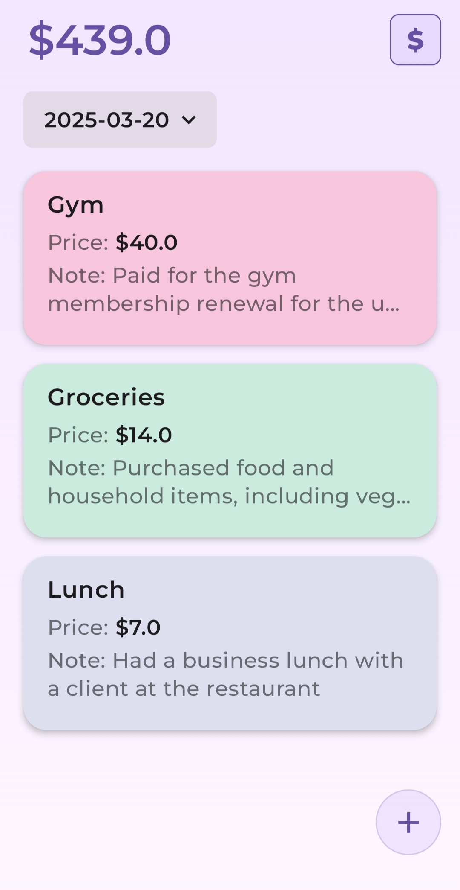
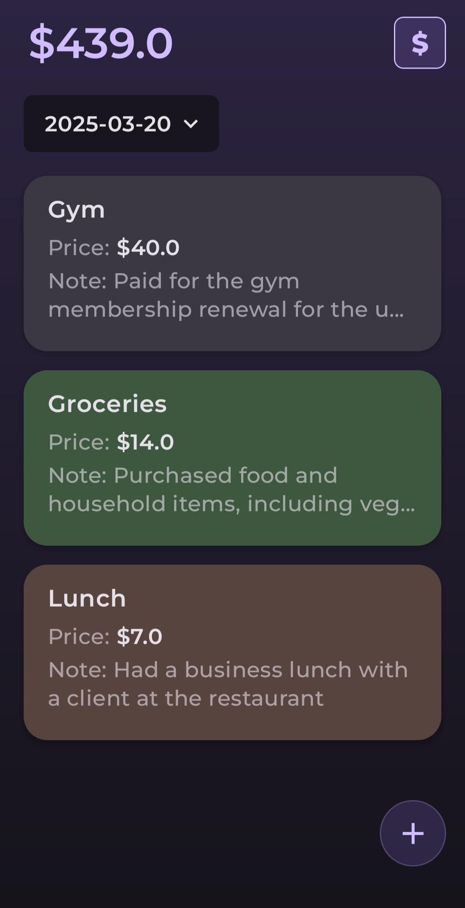
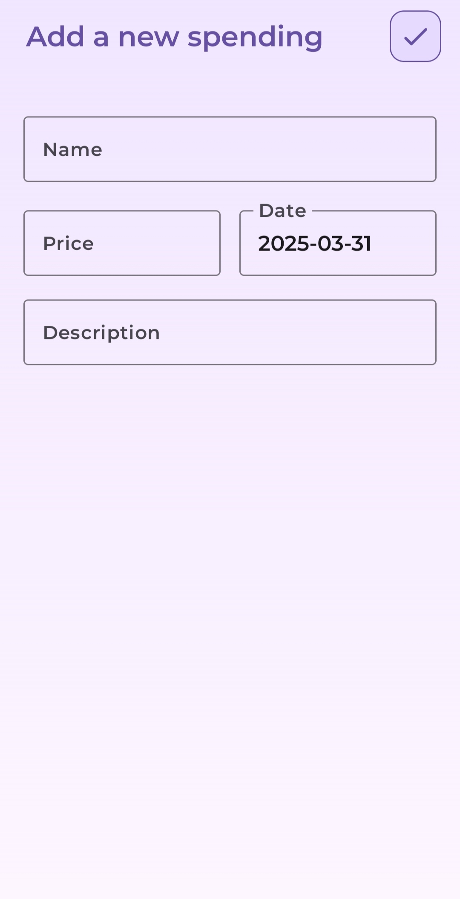

**Technologies Used:** 
  - Clean + MVI Architecture, Jetpack Compose, Kotlin Coroutine & Flow, Koin Dependency Injection, Room Database.

    
****Key Features:****
  - **Balance:** Set an initial balance for tracking expenses.
  - **Spending:** Organize expenses by date, with options to add, edit, delete, and update spending records.

****App Interface Overview:****
This document provides an overview of some key interfaces of the application.
    - **Home Screen:** Displays the current balance and a list of expenses.
        

           
        

    - **Home Screen (dark theme):**
        

           
        

    - **Add & Edit Expense Screen:** Allows users to add new expenses with details like name, date, price and description. Enables users to modify existing expenses.
        

           
        

    - **Update Balance Screen:** Allows users to set or update the initial balance.
        

           
        

